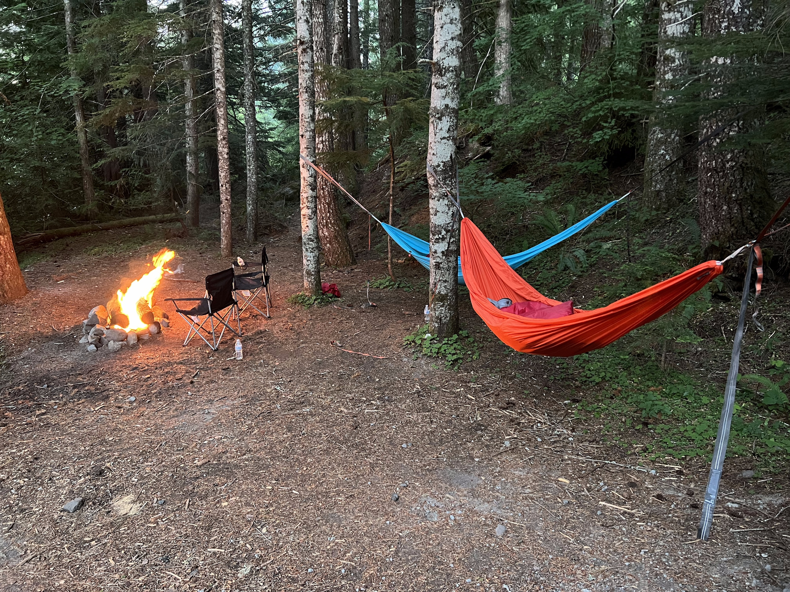
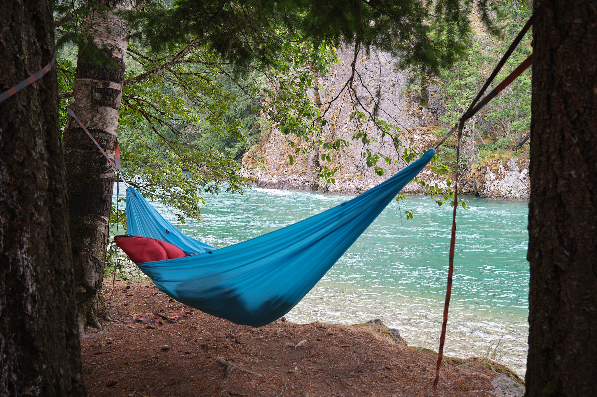

It was August 2022, and I had just spent the previous night sleeping in a
crowded campground in Long Island. I had a tent, which was already more
equipment than anyone living in an NYC apartment normally has, but I had little
else besides my sleeping bag and a blanket to separate me from the hard ground
overnight. I didn't sleep well, and my body ached. That discomfort wasn't the
end of the world, but it planted the idea in my mind that there had to be
something better.

Sure I knew the most straighforward thing was to buy some sort of pad to sleep
on, but I wanted something different — something that allowed me to do more with
less. While researching, I stumbled on the idea of hammock camping. I loved the
simplicity of it. You take a few minutes to suspend a piece of fabric between
two trees and it magically supports you. Even though I understand how it works,
it feels strange when you first sit in the hammock and the straps don't suddenly
ride down the tree, sending you plummeting to the ground.

<!--more-->

I kept the idea of hammock camping in the back of my head, and a couple of weeks
later I had the unexpected opportunity to turn it into a reality when I flew to
Washington state to go on a roadtrip with my cousin. I really loved the idea of
camping out there, but we had just flown cross-country and didn't have any gear
to our names. This is where the simplicity of the hammock felt ideal: I
suggested that one night instead of sleeping in a hotel, instead, we just buy
two hammocks and sleep in the woods. By woods what I mean is that Washington and
Oregon allow for something called "dispersed camping" in the national forests,
meaning you can camp for free outside of designated campgrounds. Usually the
popular official campsites are booked out months in advance, but you can find
great dispersed campsites last minute. While you actually can just randomly pick
any spot in the forest, usually there are places where people have camped before
that already have makeshift firepits and clearings.

With the plan in place, we drove into the Gifford Pinchot National Forest near
Mt Saint Helens and found a perfect spot to set up our camp and our hammocks. We
slept in them relatively easily and naturally and the next morning we woke up
feeling energized...really energized...weirdly energized. Who knows if it was
the fresh air, the hammock, the darkness, or the surrounding beautiful nature,
but **something** unique had happened.

We replicated this same exact feeling in a campsite near the Olympics and
another near Diablo Lake; it had happened again and again. I was convinced that
it couldn't have been a fluke.

After the trip, I could not stop thinking about how well I'd slept in the
hammock. It took over my thoughts despite the fact that I'd invested as heavily
in my bed as you could imagine...probably around $3000 in total. A beautiful
solid wood bedframe with an upholstered headboard, an expensive mattress, high
thread count sheets, shredded memory foam pillows, etc. The bed was also located
in a really nice master bedroom with its own closet and bathroom. My ego was
tied to the amenities and sunk costs of this room.

But also the bedroom was lit up by the lights outside and my windows were so
thin that they might as well not have been there. If there was a conversation
happening outside on the busy street, I could hear it. It was enough to open me
up to the idea of something new.

Moreover, at the time, I was also single and thought to myself that if I ever
was going to try this idea out, it's now. So I subjugated my ego and purchased
[this stand](https://www.rei.com/product/895846/eno-solopod-hammock-stand), this
[hammock](https://www.amazon.com/gp/product/B07Z5FF7JK), and put them into the
other tiny room in my apartment I was using as my office. The stand _barely_ fit
with barely an inch of clearance on either side, but it worked out and actually
looks really nice!

Now for the verdict: Did I recapture the magic I had found sleeping in the
forests of Washington? **I really think so.** and I've been sleeping in the
hammock ever since. Some takeaways:

- The first thing people constantly ask is if my back hurts and the answer is
  no. First, it turns out you're supposed to sleep diagonally in a hammock,
  which makes it so you lay substantially flatter, and secondly it's not
  inherently bad for you to have the minimal amount of rounding in your spine
  from not being perfectly flat.
- The most interesting thing is that it's easier to get up in the morning. You'd
  think that being sunken into a hammock would make it harder to leave than a
  bed, but I feel like it's something to overcome unlike the neutrality of a bed
  so I'm energized to fight my way to my feet.
- It's a good example of how less can be more. I had the fancy big bed, and I
  had the big room, but I was ultimately happier in the much cheaper and smaller
  hammock setup. Moreover it's an example of not giving into sunk costs
- A lot of the enjoyment of sleeping in the hammock is that it's uniquely my
  decision. It wasn't because anyone told me or suggested it to me. I sought it
  out and made it happen. I love that and it brings me a lot of happiness.

In the long term though...either I'm going to have to invent a comfortable way
to get two people sleeping in the same hammock or accept that my hammock days
could be numbered. For now though, I can keep being eccentric lol
